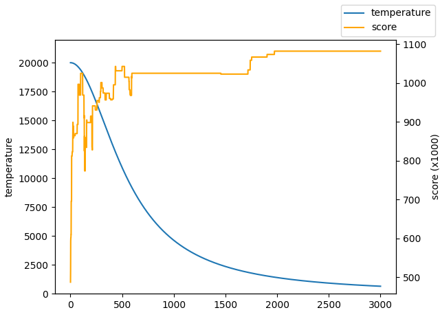

# 基于模拟退火的爆炒江湖宴会计算器

## 使用方法

- 在 `./config.hpp` 中设置参数
- 在 `./rule.hpp` 中建立规则
- 在 `./data` 下保存 `data.min.json` （下载地址：https://foodgame.github.io/data/data.min.json）和 `userData.json`（我采用的是白菜菊花里面的，不知道其他图鉴网的结构是不是一样的？）
- 编译、运行（啊啊啊这一步真的帮不了了orz 需要jsoncpp库）
- （可选）可视化：运行结束之后就可以在 `./out/plot.png` 看到自己历史路径。（如果结果不理想，可以调整 `./config.hpp` 中的参数。

  
- 最后在命令行就可以得到输出结果了！（注意顺序）（得到厨师-技法，技法指的是装备新手池+100的对应厨具，实际上并不代表一定要装这个厨具才能做到这个分数，可以在计算器里面看一下）

## 局限性

- 如果使用正常营业模式，可以预知会出现以下问题：

  - “场上所有厨师技法加成”仅对本人生效。
- 即使是在宴会模式下，也可以预知会出现一下问题：

  - **无法得到最优解！只能得到一个比较好的解，有助于开阔思路。**
  - 无法设置专精。
  - 无法选择菜品数量（默认拉满）
  - debug模式没有做（也就是说，不能看到小分）
  - rule.hpp写起来有一点麻烦，不能从文字导入规则
- 编译比较麻烦。可能有一定门槛。（这可能有助于防止这类辅助工具的滥用导致分数膨胀？）（你问我为什么不用其他语言写？python一个晚上就写好了，结果因为有涉及json读写很多类型没法推断，jit用不了，算这个太慢了，所以就用c++写了）我用vspkg做包管理，因为自身水平有限，CMakeLists.txt写的可能也不是很好，在其他平台上可能需要作出修改。
- 

## 工作原理

采用两层模拟退火来最大化总能量。第一层为三个厨师，其能量用第二层模拟退火来估计。也就是说，这套方法理论上也能算厨神，但是加上厨神的食材限制工作量有点大……以后再说吧。（希望以后的宴会不要有菜品限制）

### 最后，欢迎大家提pr！有什么问题也可以在issue里面讨论！

这算是我写的第一个项目，本人本科在读，水平有限，写的不好的地方也请大佬们斧正！
