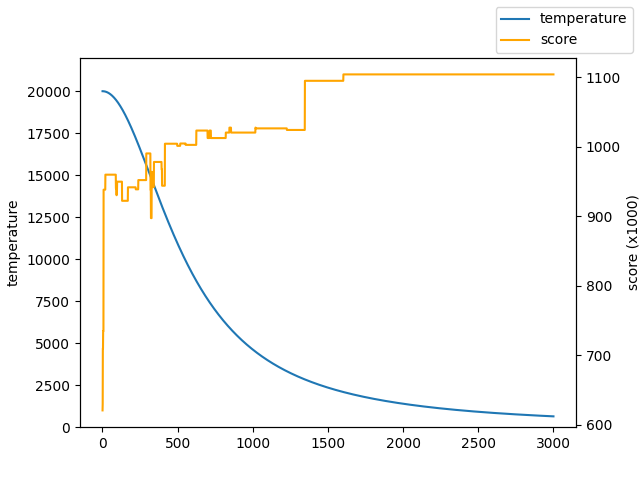
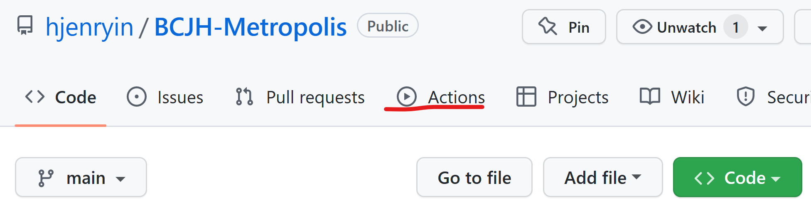
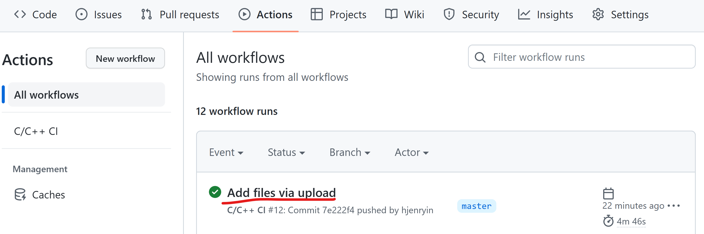
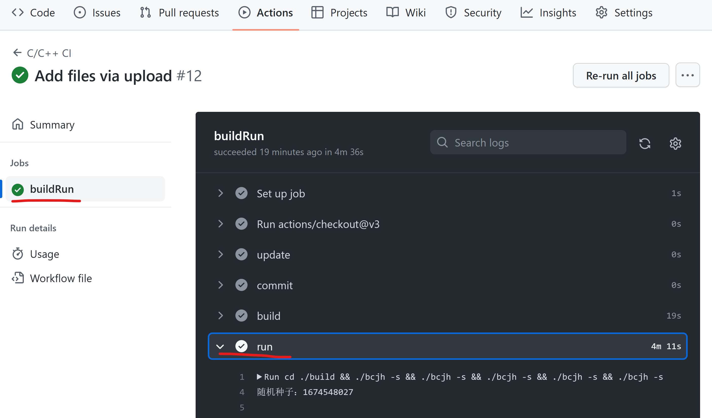

# 基于模拟退火的爆炒江湖宴会计算器

## 公告
规则已经基本实现自动更新。也就是说，只要图鉴网计算器更新了，运行一下就可以自动得到最新规则，不用等我上传最新规则了。

## 使用方法（本地）

如果在windows平台，需要使用MinGW编译，并将 `data/data.min.json` 改为ANSI编码。如有条件，强烈建议这种本地运行（运行可加速、可多次重复）。
_**另外，诚挚希望有能力的朋友们帮忙实现在客户端运行！**_

- 在 `./config.hpp` 中设置参数
- 在 `./rule.hpp` 中建立规则
- 在 `./data` 下保存 `data.min.json` （下载地址：https://foodgame.github.io/data/data.min.json ）和 `userData.json`（我采用的是白菜菊花里面的，不知道其他图鉴网的结构是不是一样的？）
- 如果需要，在 `toolEquipped.hpp` 配置已经戴上不愿碎掉的厨具。（配置方法参见 `toolEquipped.hpp`）
- 编译、运行：

  - 在根目录新建 `build` 文件夹并 `cd` 至build
  - ```
    # linux
    cmake ..
    make

    # windows
    cmake .. -G "MinGW Makefiles"
    mingw32-make
    ```
  - 使用 `./bcjh` (linux) 或 `./bcjh.exe` (windows) 运行。
- （可选）可视化：运行结束之后就可以在 `./out/history.png` 和 `./out/recipe.png` 看到自己厨师和最后一道菜的历史路径。如果结果不理想，可以调整 `./config.hpp` 中的参数，以及 `./src/functions.hpp .cpp` 中 `namespace f` 里的退火函数。

  
- 最后在命令行就可以得到输出结果了！（注意顺序）（得到厨师-技法，表示对应新手池厨具，后面的括号如果是0表示不用装厨具）

## 使用方法（云端）

- 注册Github账号，fork此仓库。
- 将白菜菊花下载的个人数据(`userData.txt`)重命名为 `userData.json`并上传到 `data/`文件夹内。如果有规则更新，此时将会自动更新。
- 上传完之后，前往Actions页面（如图所示）。这一步如果Actions里面没有东西，试着删掉文件重新上传一下。有些人确实出现了这个问题，但我也没有复现出来，都是正常的……说不定删掉重新弄一下就好了orz

  
  
  
- 等待完成后即可查看得到的几个比较好的结果。（注：无法保证得到的是最优解。）（注意顺序）（得到厨师-技法（数值），如果数值是0就表示不用装厨具，否则就装新手池对应厨具。）

## 局限性

- 如果使用正常营业模式，可以预知会出现以下问题：

  - “场上所有厨师技法加成”仅对本人生效。
- 即使是在宴会模式下，也可以预知会出现一下问题：

  - **无法得到最优解！只能得到一个比较好的解，有助于开阔思路。**
  - 无法设置专精。
  - 无法选择菜品数量（默认拉满）。
  - rule.hpp导入规则功能尚在测试。
  - 合成套餐和原套餐的矛盾无法避免。
  - 一些规则奇奇怪怪的厨师（应该就汤圆年糕）的技能没有实现。
- 可能有一定门槛。（这可能有助于防止这类辅助工具的滥用导致分数膨胀？）（你问我为什么不用其他语言写？python一个晚上就写好了，结果因为有涉及json读写很多类型没法推断，jit用不了，算这个太慢了，所以就用c++写了）

## 工作原理

采用两层模拟退火来最大化总能量。第一层为三个厨师，其能量用第二层模拟退火来估计。也就是说，这套方法理论上也能算厨神（只要能够在非常快的时间内，算出一个厨神面板的得分），但是加上厨神的食材限制工作量有点大……以后再说吧。（希望以后的宴会不要有菜品限制）

### 如果你也想为此仓库添砖加瓦……

- c++实现厨神算分
- 以及任何你觉得有意义的事！

### 最后，欢迎大家提pr！有什么问题也可以在issue里面讨论！

这算是我写的第一个项目，本人本科在读，水平有限，写的不好的地方也请大佬们斧正！
