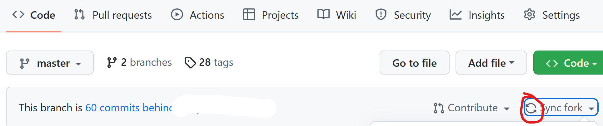
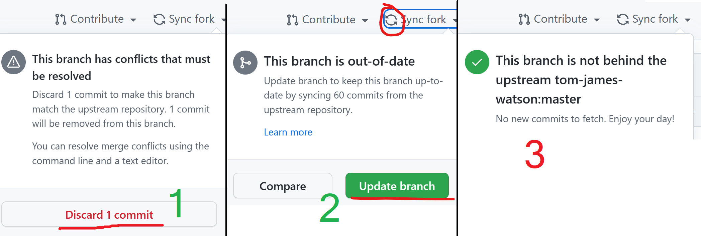

# 方法一Sync Fork（推荐）

- 如果出现**循环**箭头，请点击；如果你按照指示来到了这个页面，但未发现循环箭头，请发issue联系我。

  
- 接下来可能出现1，2，3三种情况。如果是情况1，先前你在main下的所有更改**可能（也可能不）** 需要重新提交（包括参数、userData.json、厨具信息等）。如果是情况2，选择即可。如果你按照指示来到了这个界面，却发现出现的是情况3，麻烦提个issue说明一下。

  

# 方法二PR（不推荐）

如果你对github、git非常熟悉，可以自行使用PR来合并，并自行solve conflict以保全个人数据。在此不进行展开。⚠️**但如果这个过程中出现了错误，你的大名就会出现在[这里](https://github.com/hjenryin/BCJH-Metropolis/pulls?q=is%3Apr+is%3Aclosed+-author%3AHjenryin)。😈**
